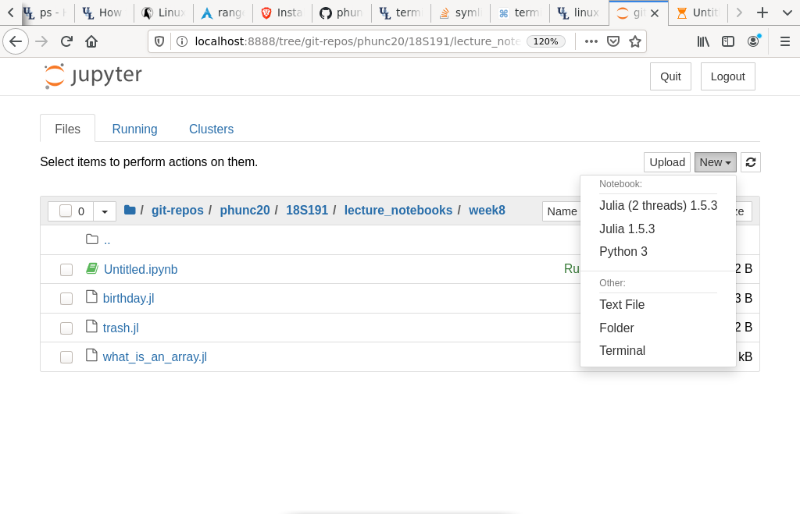

# `IJulia`
`Ijulia` is the package to install to use julia kernel inside `jupyter`. Indeed, don't forget that
`jupyter` stands for `Julia Python R`.


## Install a kernel in `IJulia / Jupyter Notebook`
Open Julia's REPL and do as follows.
```julia
julia> using IJulia
[ Info: Precompiling IJulia [7073ff75-c697-5162-941a-fcdaad2a7d2a]

julia> installkernel("Julia (2 threads)", env=Dict("JULIA_NUM_THREADS" => "2"))
[ Info: Installing Julia (2 threads) kernelspec in /home/phunc20/.local/share/jupyter/kernels/julia-(2-threads)-1.5
"/home/phunc20/.local/share/jupyter/kernels/julia-(2-threads)-1.5"

julia> notebook()
```
**Rmk.** One can indicate the root opened by `IJulia/Jupyter notebook` by specifying the arg `dir` as in `notebook(dir="~/home/downloads/")`

Once this is done, when Jupyter notebook is opened in the browser, one'd see sth similar to the following:




## How to open a jupyter notebook running julia code?
There are two ways:
01. Just as slightly mentioned above:
  - Run `julia` REPL
  - `using IJulia`
  - `notebook()` or `notebook(dir="some_dir")` **or `jupyterlab()`**
02. Choose one of your favorite Python virtual environment, be it miniconda or virtualenv(wrapper)
  - Run `jupyter-notebook` on a terminal
  - To open a new julia notebook, just click `[New] -> [Julia]`
  - To open an existing julia notebook, just click on that notebook, the program is smart enough to know which kernel to use to run the notebook.
